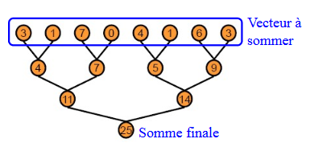
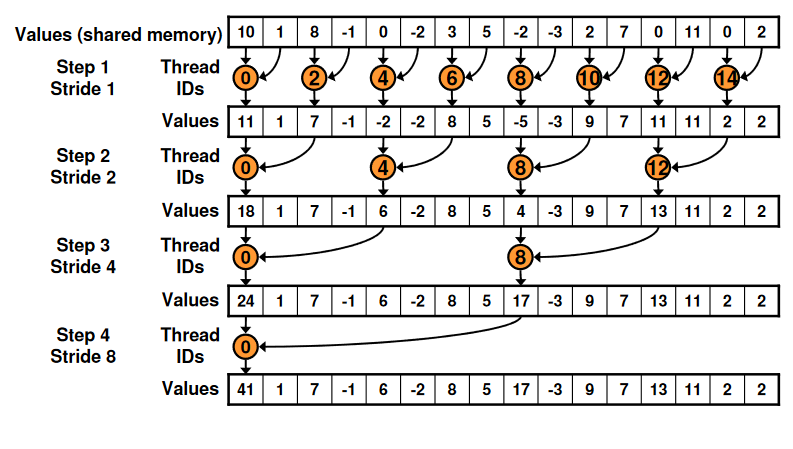
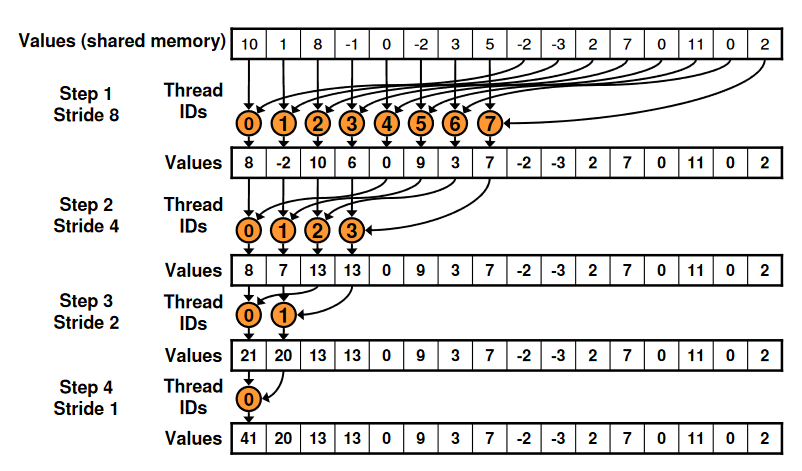

#Optimisation d'une Reduction Parallèle en CUDA

La reduction parrallèle consiste à assembler chaque élément d'un tableau afin de n'obtenir qu'un élément final représentant ce tableau (pour un tableau d'entier il s'agit d'une somme).

Nous allons ici nous servir d'une reduction parallèle d'un tableau comme exemple d'optimisation, un exemple classique dans la littérature concernant l'optimisation en CUDA, car cette réduction est facile à implémenter.
Une réduction contient du parallèlisme mais est difficile à exploiter car plus les calculs progressent et moins il y a de parallélisme, et il y beaucoup d'accès aux données et de calculs. 
La réduction est difficile de l'optimiser au maximun mais il est possible de découper cette optimisation étape par étape.

L'implémentation se feras ici avec un tableau de taille conséquante afin de pouvoir comparer les différents niveaux d'optimisation et afin de pouvoir utiliser les mécaniques de blocs de CUDA.
De plus en utilisant une taille de tableau assez grande pour occuper la totalité des threads disponibles pour notre device, nous pouvons facilement observer les gains de performances causés par une diminution de threads peu voir non actifs.

##Reduction 1 : Adressage à intervalle

Une approche de la réduction parrallèle consiste à utiliser un arbre : 

	

Afin d'implémenter cette répresentation nous allons devoir utiliser plusieurs blocs, chacun réduisant une partie du tableau.
Quel choix effectuer pour la communication des résulatts entre les diffrents blocs ? 
En synchronisant tout les threads de tout les blocs il serait facile de communiquer les résultats, il nous suffirait d'effectuer la reduction de manière recursive dans chaque blocs jusqu'à atteindr eun résultat unique à partager.
###Problème : comment effectuer une synchronisation globale

CUDA n'implémente pas de synchronisation globale pour deux raisons :
    - Pour éviter un certains nobmre de deadlocks possibles.
    - Car cela côute cher à créer au niveau hardware lorsque que le nombre de processeur est grand.

Nous allons donc devoir décomposer notre fonction en de multiples kernels en utilisant un premier thread comme point de synchronisation global.
Dans notre cas, celui d'une réduction, nous pouvons utiliser le même code pour chaque kenerl, notre invocation de kernel est donc récursive.

	

Exemple d'un kernel basique de réduction 

~~~

//g_idata est l'output et g_idata est l'input
__global__ void reduce0(int *g_idata, int *g_odata, int size){

	//vecteur de sortie partagé avec tout les threads dans un bloc
	extern __shared__ int sdata[];

	//On recupere l'endroit ou l'on ecrit dans la memoire partagé (tid) ainsi que la case que nous allons traiter (i)
	unsigned int tid = threadIdx.x;
	unsigned int i = blockIdx.x*blockDim.x + threadIdx.x;
    //Dans la cas où nous ne sommes pas dans le tableau nous renvoyons 0
	sdata[tid] = 0;
	if (i<size)
		sdata[tid] = g_idata[i];

    //__syncthreads permet de synchroniser tout les threads afin 
	__syncthreads();

	for (unsigned int s = 1; s < blockDim.x; s *= 2) {
		if (tid % (2 * s) == 0) {

			sdata[tid] += sdata[tid + s];

		}
		__syncthreads();
	}

    //On écrit le résultat de ce bloc en mémoire globale
	if (tid == 0) g_odata[blockIdx.x] = sdata[0];
}

~~~

	

Exemple d'appel de ce kernel de manière récursive :

~~~

//Nous passons notre kenerl en paramètre à notre fonction de benchmarking ainsi que la taille du vecteur à réduire
void benchmark(int size, void(*fptr)(int*, int*, int)){
    //Le nombre de threads par blocs que nous allons utiliser
	int threadsPerBlock = 1024;
    //Le nombre totals de blocs que nous devons utiliser afin de réduire l'entiéreté du vecteur
	int totalBlocks = (size + (threadsPerBlock - 1)) / threadsPerBlock;

    //Utilisation de la librairie thrust afin de créeer facilement des vecteurs host et devices permettant le transfert des données d'input et d'ouput (cf doc)
	thrust::host_vector<int> data_h_i(size, 1);
	thrust::device_vector<int> data_v_i = data_h_i;
	thrust::device_vector<int> data_v_o(totalBlocks);
	thrust::device_vector<int> data_v_o_final(totalBlocks / threadsPerBlock);

	int* output = thrust::raw_pointer_cast(data_v_o.data());
	int* input = thrust::raw_pointer_cast(data_v_i.data());
	int* ouput_f = thrust::raw_pointer_cast(data_v_o_final.data());

    //Invocation du kernel

	fptr <<<totalBlocks, threadsPerBlock, threadsPerBlock*sizeof(int) >>>(input, output, size);
	if (totalBlocks / threadsPerBlock > 1){
		//Après le premier appel si nous utilisons plus de threads que disponible dans un seul bloc, nous devons rappeler le kernel afin de réduire notre vecteur de résultat
		fptr << <totalBlocks / threadsPerBlock, threadsPerBlock, threadsPerBlock*sizeof(int) >> >(output, ouput_f, totalBlocks);

		fptr << <1, totalBlocks / threadsPerBlock, threadsPerBlock*sizeof(int) >> >(ouput_f, input, totalBlocks);
	}
	else{
		fptr << <1, threadsPerBlock, threadsPerBlock*sizeof(int) >> >(output, input, totalBlocks);
	}
	
    //Nous attendons la fin de l'éxecution de chaque bloc, les kernels n'étant pas bloquant pour le CPU
	cudaDeviceSynchronize();

    //Traitement des résultats
	data_v_o[0] = data_v_i[0];
	data_v_i.clear();
	data_v_i.shrink_to_fit();

	thrust::host_vector<int> data_h_o = data_v_o;

	data_v_o.clear();
	data_v_o.shrink_to_fit();

	cout << "Somme : " << data_h_o[0] << endl;
}

~~~

###Problème : branchement divergents

Rappel : Les threads d'un bloc sont regroupés en warps de taille fixe pour l'exécution sur un noyau CUDA, et les threads dans un warp doivent suivre la même trajectoire d'exécution. Tous les threads doivent exécuter la même instruction en même temps. En d'autres termes, les threads ne peuvent pas diverger.

##Reduction 2 : Kernel 

~~~

//g_idata est l'output et g_idata est l'input
__global__ void reduce1(int *g_idata, int *g_odata, int size){

	//vecteur de sortie partagé avec tout les threads dans un bloc
	extern __shared__ int sdata[];

	//On recupere l'endroit ou l'on ecrit dans la memoire partagé (tid) ainsi que la case que nous allons traiter (i)
	unsigned int tid = threadIdx.x;
	unsigned int i = blockIdx.x*blockDim.x + threadIdx.x;
    //Dans la cas où nous ne sommes pas dans le tableau nous renvoyons 0
	sdata[tid] = 0;
	if (i<size)
		sdata[tid] = g_idata[i];

    //__syncthreads permet de synchroniser tout les threads afin 
	__syncthreads();

	for (unsigned int s = 1; s < blockDim.x; s *= 2) {
		int index = 2 * s * tid;

		if (index < blockDim.x){
			sdata[index] += sdata[index + s];
		}
		__syncthreads();
	}

    //On écrit le résultat de ce bloc en mémoire globale
	if (tid == 0) g_odata[blockIdx.x] = sdata[0];
}

~~~

###Problème : Conflit des bancs de mémoires partagées

##Reduction 3 : Adressement Séquentiel

Nous remplacons l'index strided de la boucle par une boucle inversé et un index basé sur l'id des threads.
~~~

	for (unsigned int s =blockDim.x / 2; s>0; s >>= 1) {
		if(tid < s) {
			sdata[tid] += sdata[tid + s];
		}
		__syncthreads();
    }

~~~

	

###Problème : Threads inactifs

